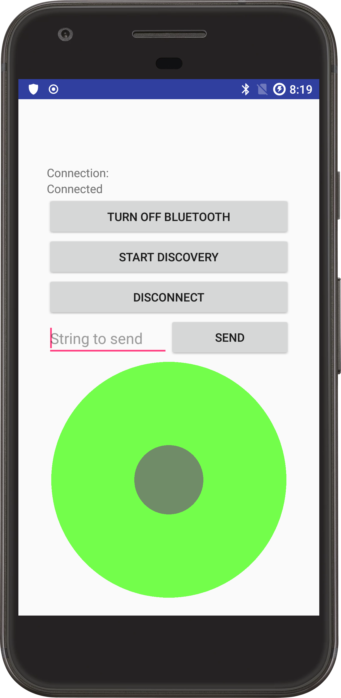
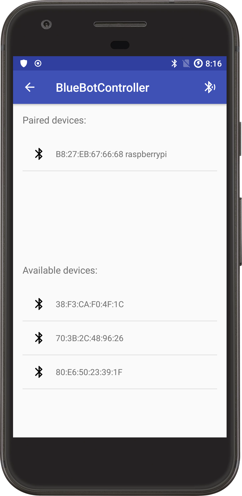
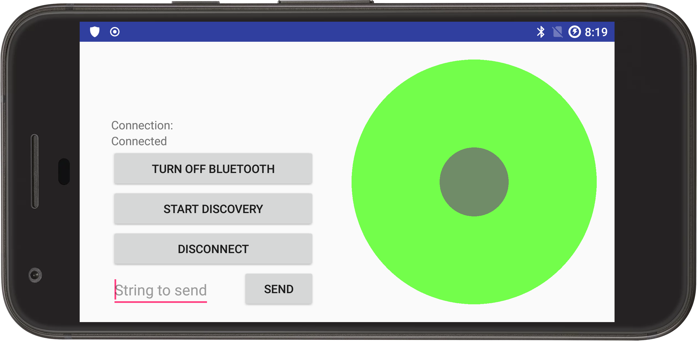

# BlueBotController

## UML Diagram

## Features:
1) The app uses MVP design pattern
2) A custom JoystickView simulates a lever-based joystick interface
3) Joystick positions are normalized with values between -100 and 100
4) Joystick continuous "position hold" functionality implemented using a dedicated HandlerThread
5) Asynchronous Bluetooth communication is implemented using **RxJava**
6) **Test Driven Development** practices were applied while overhauling the old version of this app
7) Added ability to send custom commands to the rover (currently only supports "_off" for safe rover shutdown)

## Overview
This is a basic Android App which controls Raspberry Pi W-based rover.  
It communicates over standard Bluetooth sockets using Serial Port Profile.  
A custom JoystickView serves as a user input mechanisms to control the rover.
The JoystickView takes the handle position and translates it into control input.
The X and Y coordinates specify direction, while the distance from the center specifies the motor speed.

The directional and control commands are sent in a specially-formatted string over the the serial Bluetooth connection.
The Python script on the Pi side seeks out valid commands using regular expressions,
parses the input and activates appropriate GPIO pins [See python page](https://github.com/vrestivo/pibluebot_public).

## Screenshots

 

## Video Overview
#### NOTE:  the video linked below shows the old version of the app.

